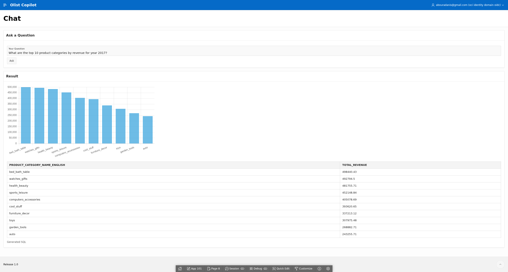
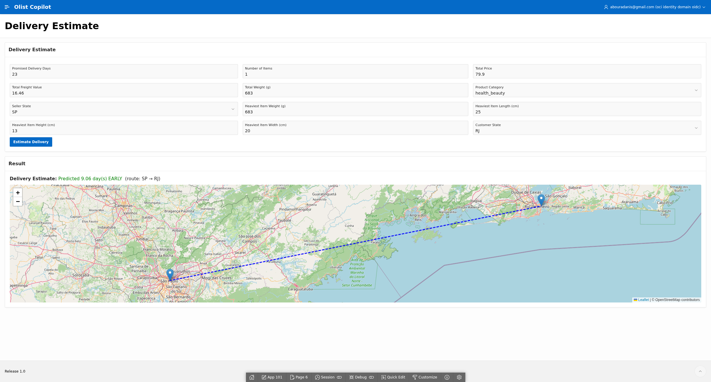

# OCI AI Playground

**[View the project showcase &rarr;](https://bouradanis.github.io/oci-ai-playground/)**

A running collection of small, real applications built on Oracle Cloud's
Always Free tier and an Autonomous Database — each one a case study in
cloud data engineering, ML, and AI-assisted app development.

## Olist Copilot

An Oracle APEX + FastAPI app over a 99k-order Brazilian e-commerce dataset —
ask it a question in plain English and it writes the SQL itself; ask it about
a shipment and a trained regression model predicts the delay.

**[Try the case study &rarr;](https://bouradanis.github.io/oci-ai-playground/olist-copilot/)**

  
  

**What it does**
- Text-to-SQL chat (Claude-generated SQL against the live schema, rendered as a table + chart)
- Live delivery-delay prediction (Oracle OML GLM model, Leaflet route map)
- Classic BI reporting (Interactive Report/Grid over Orders and Sellers)
- APEX-native OIDC login via OCI Identity Domain

**Built with:** Oracle Autonomous Database · Oracle APEX 24.2 · FastAPI · Claude (Anthropic) · OML4Py/GLM · Chart.js · Leaflet.js · OCI Compute · nginx + Let's Encrypt
